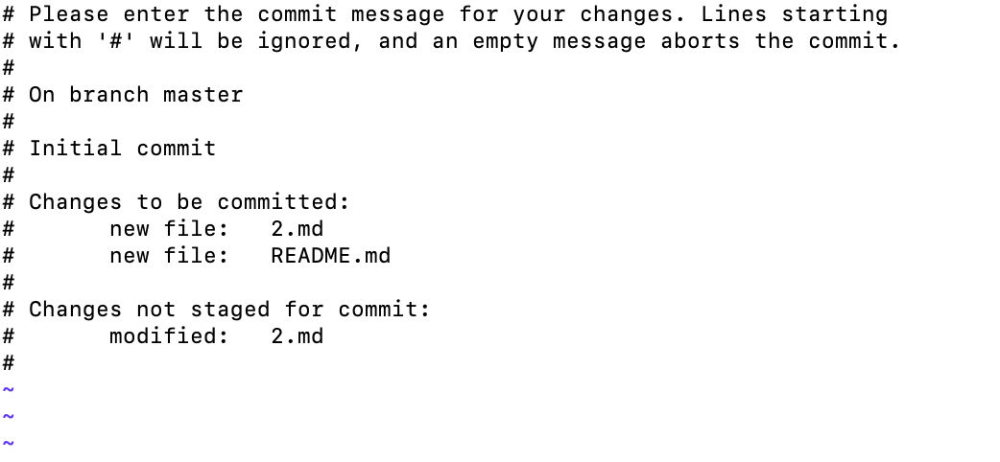
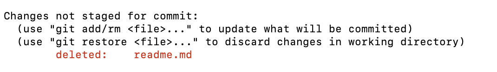
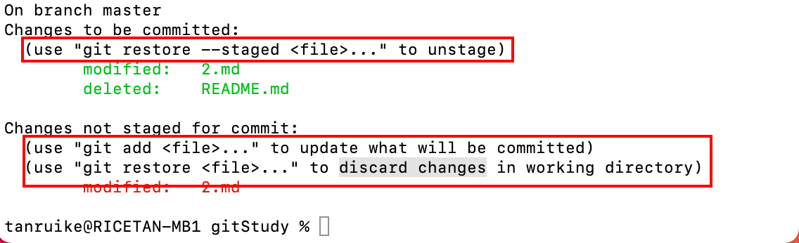

> 通过学习这一部分内容，你就可以开始使用Git了

# 获取Git仓库

两种方式

1. 将现有项目加入Git中
2. 从服务器上克隆现有的Git仓库

## 初始化Git仓库

要想让现有项目加入Git，只需要进入项目目录并输入：

`git init`


这个命令会在此目录下创建一个`.git`的目录，这个目录包含了构成Git仓库骨架的所有必须的文件。

如果后面你不想此项目继续使用Git的话，你可以试试`rm -rf .git`。

## 克隆现有仓库

如果需要获取现有仓库的一份副本，可以使用`git clone`命令.Git会对服务器仓库的几乎所有数据进行完整复制，而不是只复制当前工作目录。`git clone`默认会把服务器上整个项目历史中每个文件的所有历史版本都拉取下来。如果你的服务器磁盘损坏了，也可以通过客户端的仓库进行恢复。

克隆仓库需要使用git clone [url]命令。

`git clone https://github.com/tanruike/gitstudy`

这会创建一个gitstudy的新目录，并在其中初始化`.git`目录，然后将远程仓库中的所有数据拉取到本地并检出最新版本的可用副本。

如果你想讲项目克隆到其他名字的目录中，可以目录名作为命令行选项传入：

`git clone https://github.com/tanruike/gitstudy mygitstudy`

Git除了使用以上的http协议，还可以使用git和ssh协议。

# 在仓库中记录变更

现在已经有一个Git仓库了，下一步就是做出一些更改，当项目到达某个需要记录的状态时间向仓库提交这些变更的快照。

工具目录中的每个文件都会处于两种状态之一：未跟踪（untracked）和已跟踪（untracked）。

已跟踪说的是指上一次快照中包含的文件，这部分文件又可以分为未修改、已修改、已暂存三种状态。未跟踪的就是除了已跟踪之外的文件。当你完成仓库克隆时，所有的文件都处于已跟踪未修改的状态。

如果修改了文件，那么它的状态就会变成已修改，此时你可以将这些文件加入暂存区，提交所有的已暂存的文件。然后重复这个过程。

大致情况如下图所示


## 查看当前文件状态

查看当前文件的状态所使用的是`git status`命令

比如：


上述说明你的仓库中有两个文件处于未追踪的状态，因为这两个文件是新创建的。在上一次快照中并没有这两个文件。Git不会主动将这些文件包含到下一次提交的文件范围中，这让可以避免不小心将不想追踪的文件包含进来。

当然你也可以添加`.gitignore`文件来提醒Git你不想添加那些文件或者目录。

## 跟踪新文件

使用`git add`命令让Git开始跟踪新的文件。执行一下命令来跟踪未跟踪的文件。

`git add 2.md`

执行后可以查看文件的状态


可以看到 2.md 在暂存区等待被提交

也可以使用`git add .`来添加所有未追踪的文件


## 暂存已修改的文件

现在我修改一下2.md文件，2.md之前已经被追踪过了。使用`git status`来查看文件的状态


2.md出现在了已修改但未暂存的区域中，这说明处于被追踪的文件应该被修改了，但是还没有被添加到暂存区。想要暂存这些文件，需要执行`git  add`命令。这个命令既可以用来追踪新文件，也可以用来暂存文件，还可以把存在合并冲突的文件标记为已解决。

我们可以把`git add`命令看成 添加内容到下一次提交中 。此时我们执行`git add`在次查看文件的状态。


注意上面第一章图中，2.md同时出现在了暂存去和已修改未暂存区，这是因为在暂存后文件又发生了更改，而暂存去保存的是下次要提交的内容。

## 显示更简洁的信息

`git status -s`	或者 `git status --short`


已暂存的文件会有A标记，已修改的文件会有M标记。左列表明了文件是否已暂存，右侧则是是否修改。未被追踪的文件则会出现`??`标记。

## 忽略文件

如果你不希望某个文件或者某个文件夹被Git添加，甚至不想让其出现在未被追踪的列表下面。比如说`.idea`、日志文件等。在这种情况下，可以创建名为`.gitignore`文件，在这个文件中列出你不想添加的文件。

例如输入以下命令：

```
cat .gitignore
*.idea
```

这个文件告诉Git忽略所有以`.idea`结尾的文件。

文件的匹配规则如下所示：

- 以#开头的行会被忽略。相当于注释
- 支持标准的glob模式（简化版的正则表达式）
- 以 / 开头的模式用于禁止递归匹配
- 以 / 结尾的表示目录
- ！开始的表示取反


讲一些常用的正则表达式：

- `*`匹配0个或更多字符
- [abc]匹配括号内的任一字符
- `?`匹配任一单个字符
- [0-9]范围匹配
- 。。。

更多的可以查看GitHub所维护的`.gitignore`文件

## 查看已暂存和未暂存的变更

看到这里你可能会说前面的`git status`不就是查看变更吗？那么你可以继续往下看。

`git diff`这个命令不同于`git status`，它可以告诉你修改的具体内容，而不仅仅是修改了那些文件，`git diff`输出的是补丁。

比如我执行`git status`命令


可以看到有一个修改为暂存的文件。那么输入`git diff`呢？


其中的+号就是新添加的内容。

这条命令会将工作目录中的内容和暂存去的文件做一个对比，对比的结果就是显示的内容。


这里需要注意的是这个文件必须是对追踪过的文件，并且是与暂存区的文件做对比，如果你将所有的变更都添加进了暂存区，那么这个命令不会有任何输出。

## 提交变更

当你的暂存区已经准备好了，你想让这些文件进入Git仓库，那么你可以使用`git commit`命令来提交这些内容，需要注意的是未加入暂存区的内容并不会被提交。

`git commit`

当你输入这个命令之后，会自动打开一个文本编辑器，用于提示你输入这次提交的提交信息。



你可以在上面输入你这次提交的主要变更内容，以便于给其他开发者一个提示。


然后按`esc` 然后输入 ：wq保存退出


这将清空你的暂存区。

当然上述的步骤有点复杂，你可以可以在提交的时候直接在命令行键入提示信息。只需要在后面加上 -m 选项。

`git commit -m 'git 基础'`


提交之后你可以看到此次提交的一些相关的信息，包括分支，校验和，改动了多少文件及行数。

## 跳过暂存区

如果你不想将文件添加到暂存区，在提交的话，你可以跳过暂存区直接进行提交。你可以加上 -a 选项：

`git commit -a -m 'new commit'`

## 移除文件

如果你有以下需求，将某个文件从Git中移除，如果你只是简单的删除文件，那么执行`git status`是就会发现文件出现在了`change not staged for commit`区域



这是你执行`git rm`，Git才会把文件的移除状态记录到暂存区。


这样你下次提交的时候，这个文件就不存在了，也不会被Git追踪了。


当然这样子你的文件也会被删除，如果不只是不想文件被追踪，当时想保留在工作目录，只需要加上 `--cached`选项即可。

`git rm --cached README.MD`

当然也可以穿正则表达式进行匹配


## 移动文件

如果你在目录中重命名了文件，Git仓库的元数据并不会记录这次操作。所以可以使用以下命令进行重命名。

`git mv file_from file_to`

实际上这个命令执行了以下三个命令

`mv  file_from file_to`

`git rm file_from`

`git add file_to`

# 查看提交历史

使用`git log`可以查看所有的提交历史。最新的提交会显示在最前面。


如果你加上`-p`参数，他会显示每次提交的差异，还可以加上 -2 只显示两次提交。


当然还有其他选项可供选择，这里不一一赘述。有需要可自行查阅。

# 撤销操作

如果你在提交之后，发现某个文件没有提交上，或者写错了提交信息，如果你想重新尝试提交，可以试试 `--amend` 选项

`git commit --amend`

这个命令会提交暂存区的内容。如果你未做任何改动，那么提交快照不会有改变，但你可以改变提交信息。

比如过，你提交后发现忘记添加某个文件，你可以：

`git commit -m 'initial commit'`

`git add forgotten_file`

`git commit --amend`

最终只产生了一次提交，因为第二个提交命令修正了第一个提交的结果。

## 撤销已暂存/已修改的文件

看下面这张图片



通过提示可以看出你可以使用

`git restore --staged file_name`将文件移除暂存区


当然可以撤销对文件的修改。可以使用`git  restore <file>`，==但需要注意的是，如果你一但执行，那么这些修改则再也找不回来。== 如果你只是暂时的想要隐藏这些修改可以使用`git stash`命令。


通过这一节的学习，你已经基本可以独立的使用git了，关于远程仓库的使用和分支在后面我会逐步介绍。


# 远程仓库的使用

要参加任何一个Git项目的协作，那么对远程仓库的使用时非常重要的。远程仓库指的是在互联网或其他网络上托管的项目仓库版本，比如GitHub上的仓库。


## 添加远程仓库

前面其实已经讲过如何添加远程仓库，比如使用`git clone`命令就可以将远程的仓库拉取下来。还有一种显式地添加仓库的方法，可以添加一个远程仓库，并给仓库起一个简单名称以便引用。可以执行`git remote add [shortname] [url]`命令。

比如：

`git remote add gs https://github.com/XXXXX/gitstudy.git`

然后你就可以使用gs来替代完整的URL在后续的命令中了。

## 显示远程仓库

如果想要查看使用了哪些远程仓库，你可以使用`git remote`命令。该命令会显示每个远程仓库的简短名称。在克隆某个仓库后，你至少可以看到名为origin的远程仓库，这是Git仓库取的默认名称。


你也可以使用`-v`选项，这会显示Git存储的每个远程仓库对应的URL


这个命令会列出所有的远程仓库地址。

## 从远程仓库拉取数据

要从远程项目获取数据，可以执行：

`git fetch [remote-name]`

这条命令会从远程仓库中获取本地仓库中没有的数据。执行这条命令之后，你就可以在本地引用远程仓库包含的所有分支，并可以在任何时候合并或检查这些分支。

我现在在远程仓库添加了一个新文件


执行`git fetch`命令


执行`git merge gs/master  `会把更新内容合并到本地仓库


当然如果你有一个跟踪某个远程分支的本地分支，可以使用`git pull`自动获取远程数据，并将远程分支合并到本地分支。


`git fetch`和`git pull`的区别就是`git fetch`当你准备好之后需要手动输入命令进行合并，看起来似乎更安全。


## 将数据推送到远程仓库

当你的工作成果已经完成，你想要将变更推送到远程仓库去，你可以使用`git push [remote-name] [branch-name]`，将其提交推送给远程仓库。

