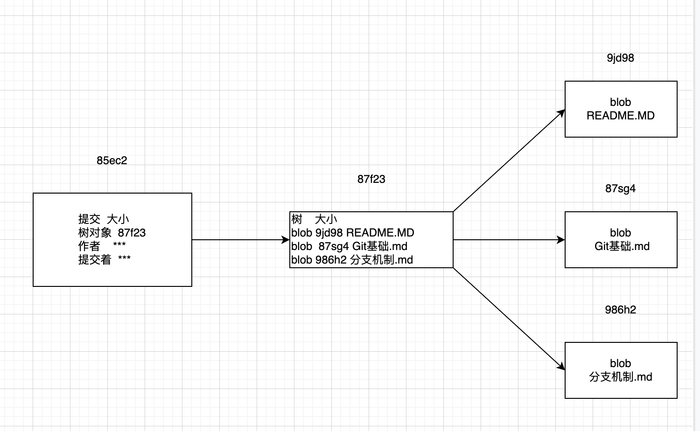
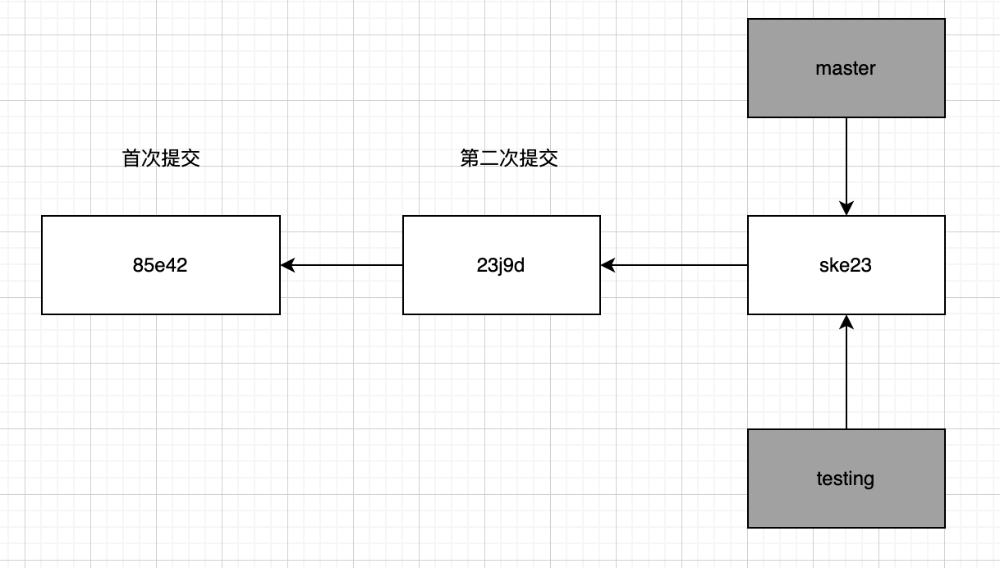
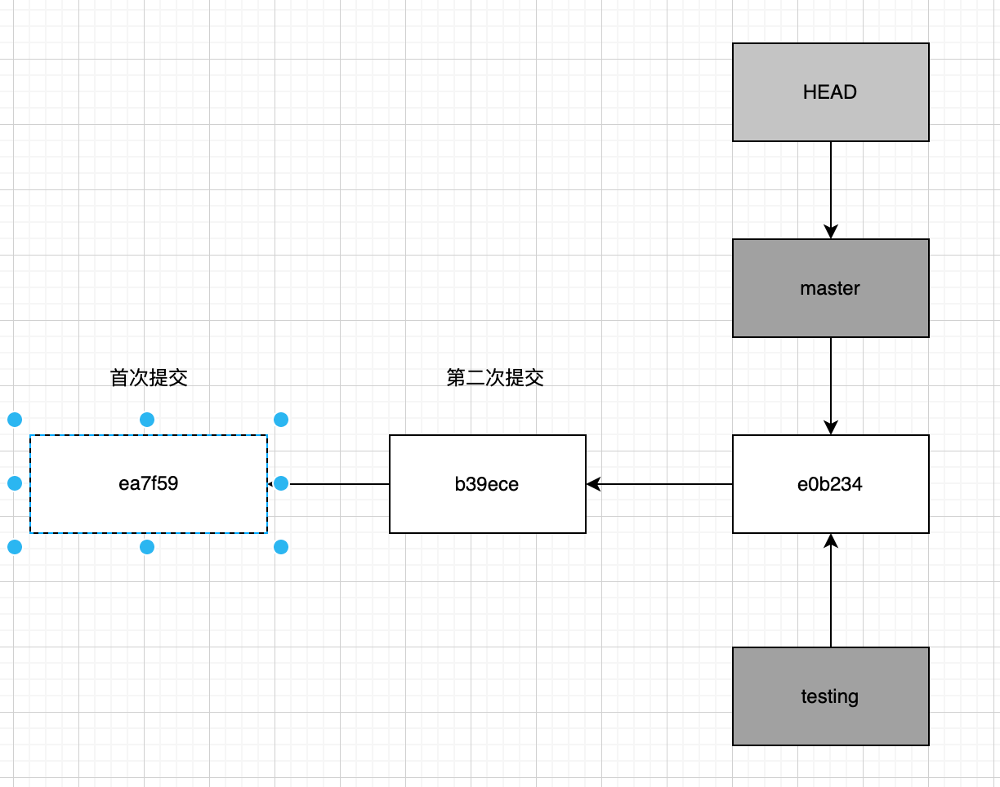
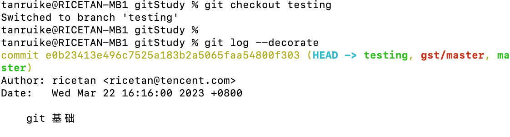

> Git的分支模型是Git的杀手锏特性


# 简述

首先我们来看一下Git是如何存储数据的。

Git通过一系列的快照的方式来存储数据，当你发起提交时，Git存储的事提交对象，其中包含了只想了暂存区的快照的指针。提交对象也包括作者姓名和邮箱地址、已输入的提交信息，以及指向其父提交的指针（上一次提交）。

下面我们通过一个图来解释，假设我们有一个包含了3个文件的目录，这三个文件都加入了暂存区并进行了提交，暂存会计算校验和，并把文件的当前版本保存到Git仓库中（这些数据叫做blob对象），然后吧检验和添加到暂存区。

加入我们将一下三个文件进行提交。

```
git add README.MD Git基础.md 分支机制.md
git commit - m 'first commit'
```

GIt会进行一下操作：

- 计算每个子目录的检验和
- 将这些树对象保存进Git仓库中
- 创建提交对象，其中包括元数据以及指向目录跟目录的树对象的指针

现在Git仓库中有五个对象：3个blob对象（文件内容），一个树对象（记录目录结构，以及和blob对象和文件的关系）以及一个提交对象（其中包含提交的全部元数据和指向根目录对象的指针）

大概如下图所示：



之后你又做了一些更改，并又进行了一次提交，这第二次提交就会指向他的想一次提交。


Git分支只不过是一个指向某次提交的轻量级的可移动指针。Git默认的分支名称是master，当你发起提交的时候，就有了一个指向最后一次提交的master的分支。每次提交之后他都会自动向前移动。

## 创建新分支

当你创建新的分支的时候，Git会创建一个可移动的新指针供你使用。我们可以通过`git branch`命令来创建一个名为testing的分支。

`git branch testing`

这会创建一个指向当前提交的新分支



那么就有了一个问题：GIt如何知道你现在处于哪个分支上呢？其实Git维护着一个HEAD指针，这个指针指向的就是你当前所处的分支。



可以简单的通过`git log`命令来查看各个分支当前所指向的对象。可以使用`--decorate`来查看


可以看到master和testing分支都处于最新的一次提交之上。并且HEAD处于master分支。

## 切换分支

要进行分支的切换，可以使用`git checkout`命令。

`git checkout testing`

这会使HEAD指针指向testing分支



这样做的意义是什么呢？当我们再次提交一次快照。
