> Git的分支模型是Git的杀手锏特性


# 简述

首先我们来看一下Git是如何存储数据的。

Git通过一系列的快照的方式来存储数据，当你发起提交时，Git存储的事提交对象，其中包含了只想了暂存区的快照的指针。提交对象也包括作者姓名和邮箱地址、已输入的提交信息，以及指向其父提交的指针（上一次提交）。

下面我们通过一个图来解释，假设我们有一个包含了3个文件的目录，这三个文件都加入了暂存区并进行了提交，暂存会计算校验和，并把文件的当前版本保存到Git仓库中（这些数据叫做blob对象），然后吧检验和添加到暂存区。

加入我们将一下三个文件进行提交。

```
git add README.MD Git基础.md 分支机制.md
git commit - m 'first commit'
```

GIt会进行一下操作：

- 计算每个子目录的检验和
- 将这些树对象保存进Git仓库中
- 创建提交对象，其中包括元数据以及指向目录跟目录的树对象的指针

现在Git仓库中有五个对象：3个blob对象（文件内容），一个树对象（记录目录结构，以及和blob对象和文件的关系）以及一个提交对象（其中包含提交的全部元数据和指向根目录对象的指针）

大概如下图所示：


之后你又做了一些更改，并又进行了一次提交，这第二次提交就会指向他的想一次提交。


Git分支只不过是一个指向某次提交的轻量级的可移动指针。Git默认的分支名称是master，当你发起提交的时候，就有了一个指向最后一次提交的master的分支。每次提交之后他都会自动向前移动。

## 创建新分支

当你创建新的分支的时候，Git会创建一个可移动的新指针供你使用。我们可以通过`git branch`命令来创建一个名为testing的分支。

`git branch testing`

这会创建一个指向当前提交的新分支


那么就有了一个问题：GIt如何知道你现在处于哪个分支上呢？其实Git维护着一个HEAD指针，这个指针指向的就是你当前所处的分支。


可以简单的通过`git log`命令来查看各个分支当前所指向的对象。可以使用`--decorate`来查看


可以看到master和testing分支都处于最新的一次提交之上。并且HEAD处于master分支。

## 切换分支

要进行分支的切换，可以使用`git checkout`命令。

`git checkout testing`

这会使HEAD指针指向testing分支


这样做的意义是什么呢？当我们再次提交一次快照。

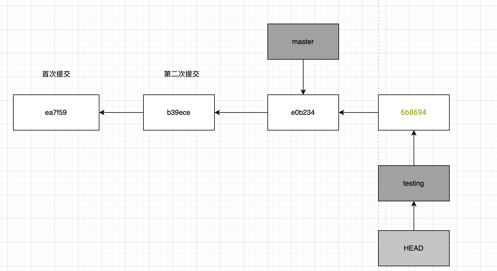

这个时候发生的是testing分支已经向前移动，master分支还处于原来的位置。

此时如果我们切换到master分支。

`git checkout master`

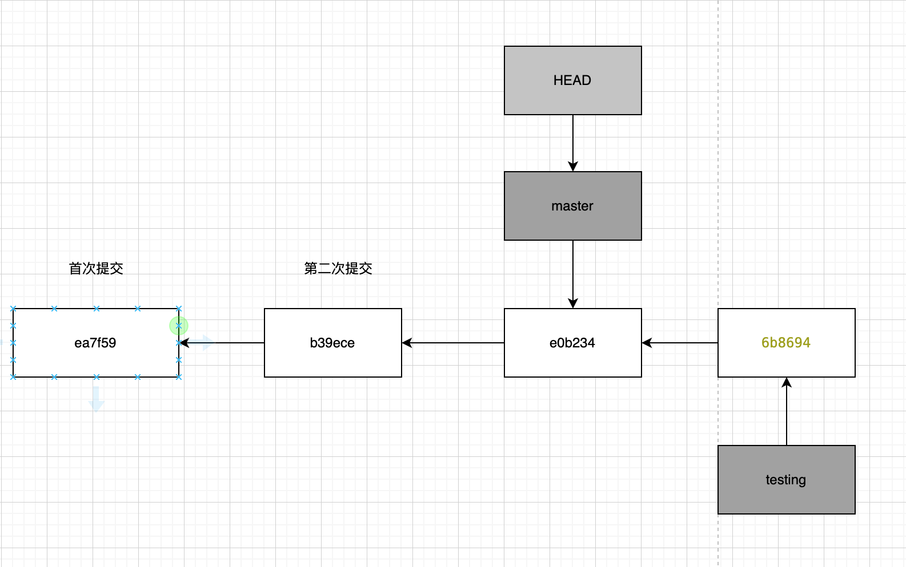

HEAD指针也会发生移动。当然你的工作目录也会变回master分支所处的状态。上述操作回滚了你在testing分支所做的工作，使你能在另一个方向进行开发。

> 切换分支会更改工作目录，如果你切换到较旧的分支，工作目录也会被恢复到该分支上最后一次提交的状态。


如果此时你在master上进行了一次修改提交。

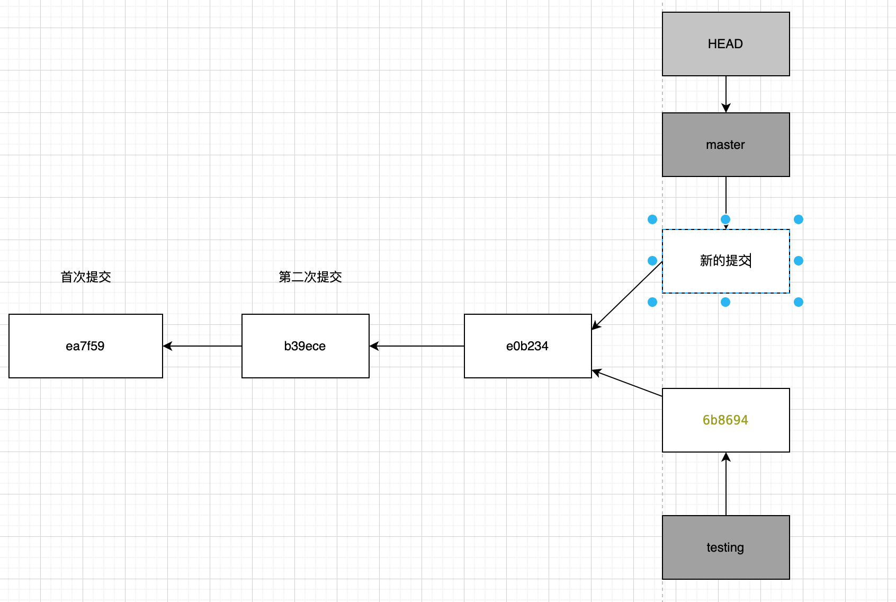

现在的项目历史已经发生了分叉，这两次修改是在不同的分支上进行的，彼此互相分离，你可以在分支上来回切换。当你准备好了之后你就可以合并这两次修改。

使用`git log --oneline --decorate --graph --all `命令，会输出提交历史，显示出分支指向以及项目历史的分叉情况

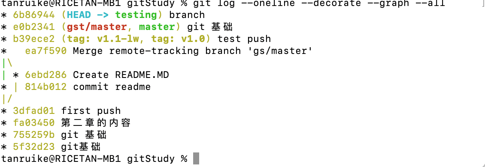

Git分支其实是一个简单的文件，其中包含了该分支所指向提交的校验和。所以Git创建和删除分支的成本很低，你可以随便的创建分支来进行开发。


# 基本的分支与合并操作

## 基本的分支操作

假设你已经在你的项目上有了一些提交

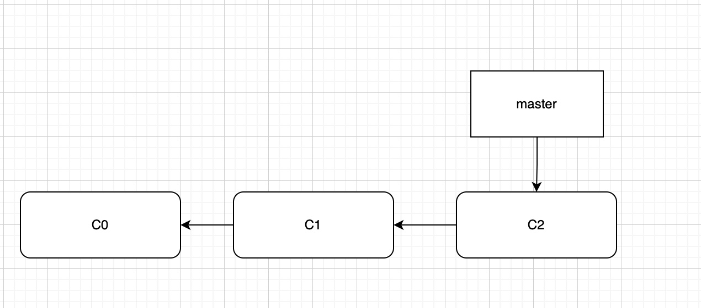

这个时候你想要去修复一个新的问题。你可以使用-b选项的`git checkou`命令来创建并切换分支。

`git checkout -b iss53`

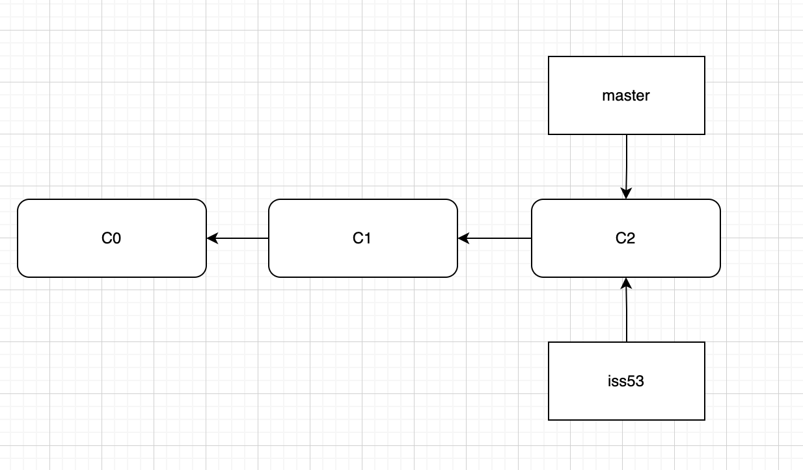

接下来你在新的分支上进行了工作并进行了几次提交。这样会让iss53分支向前移动。

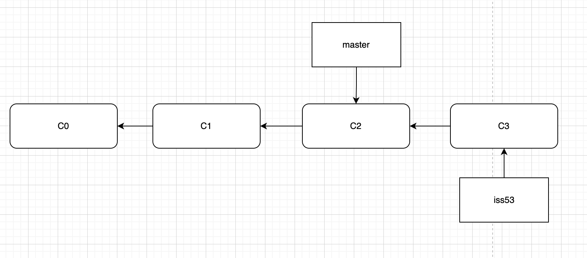

假设此时需要你紧急修复一个补丁，此时你就需要切换到master分支。

需要注意的是，如果你的工作目录或者暂存区存在着未提交的更改，并且这些更改与你要切换的分支冲突，Git就不允许你切换分支。在切换分支时，最好保证一个干净的工作区域。假设我们已经提交了修改，然后切换到master分支。

此时的状态就和处理iss53之前的状态一样。此时你可以基于master分支重新创建一个分支来修复补丁。

`git checkout -b hotfix`

然后进行你的工作进行提交。

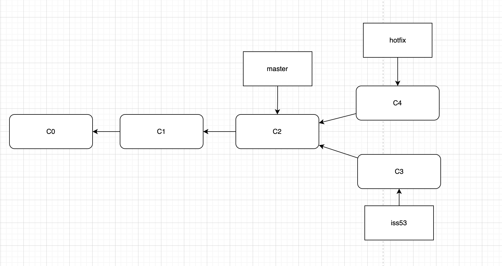

当你测试你的补丁无误后，你可以将其合并到maser分支，以便部署到生产环境。使用`git merge`命令来完成上述操作。

这里需要注意的是master处于我们要合并分支的上游。所以Git会将master分支指针向前移动。

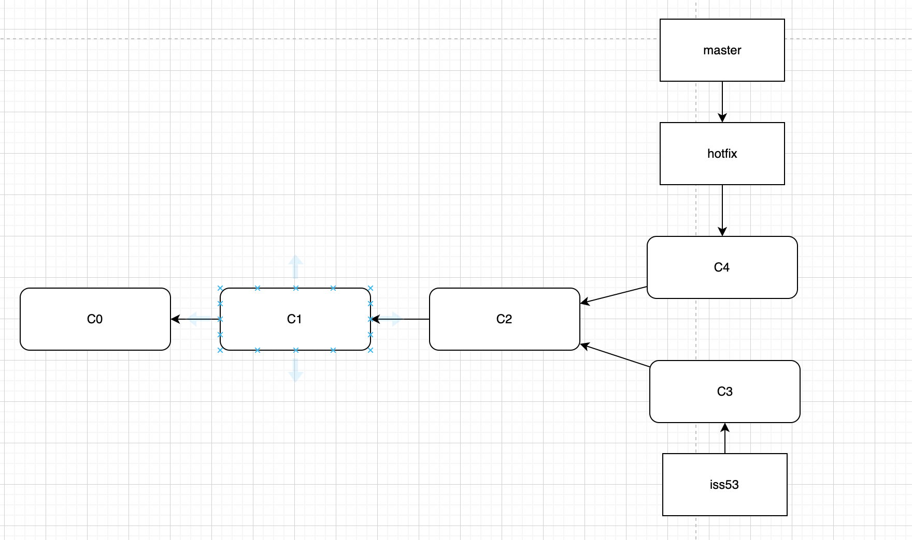

当你部署完这次的修改之后。你想要回到之前的工作。你可以切换到未完成的iss53分支继续你的工作。在这之前你可以删除hotfix分支 ，因为它用不着了，因为他和master指向的位置相同。

你可以使用`git branch -d hotfix`来删除分支，然后使用`git checkout iss53`继续你的工作


需要注意的是iss53分支并不包含你在hotfix分支上所作的工作，如果你需要把上述的修复工作并入iss53，就需要执行`git merge master`使得master分支合并到iss53中。或者最后将你的修改合并到master分支。

## 基本的合并操作

假设现在iss53的工作已经完成，可以合并回master分支了。现在只需要切回到master分支，并执行`git merge`操作即可。

`git checkout master`

`git merge iss53`

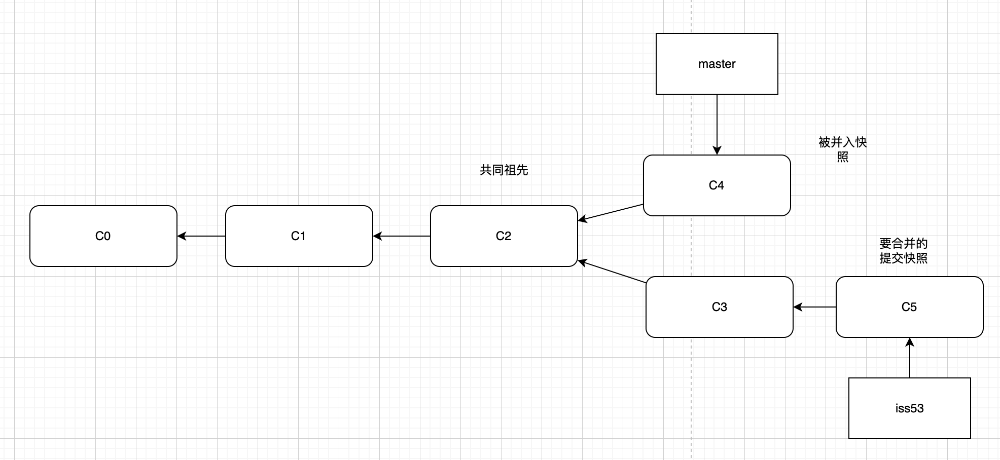

这次的合并有一点的不同，开发历史从最早的祖先发生了分叉。master分支并不是iss53分支的直接祖先，因此Git必须做一写额外的工作。

与之前简单的移动指针不同，Git会基于三方合并的结果创建一个新的快照。然后创建一个提交指向新建的快照。这个操作叫做 合并提交 。特殊性在于它拥有不止一个父提交。


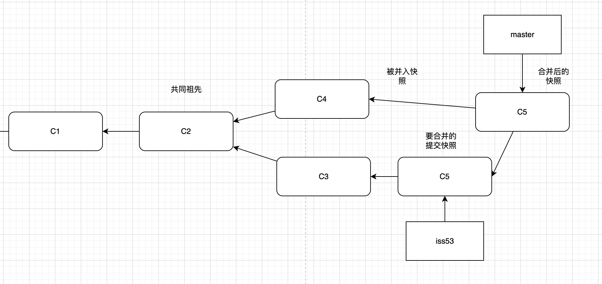

Git会自己判断最优的共同祖先并将其作为合并基础。这个时候如果你用不到iss53分支，你就可以将其删除。


## 基本的合并冲突解决

有时候合并并不会这么顺利，如果两个分支同事修改了同一个文件的同一部分内容，Git就没办法干净的合并这部分内容，Git也不清楚你需要的是那次修改。这个时候就需要你手动的进行解决。

假设基于master分支创建了一个test分支，随后在分别在两个分支修改并进行提交，然后需要合并test分支到master。

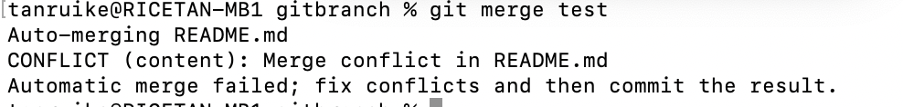

Git并没有自动创建新的合并提交。它会暂停整个合并过程，等待你来解决冲突。

要查看哪些文件没有合并，你可以使用`git status`来查看

```
On branch master
You have unmerged paths.
  (fix conflicts and run "git commit")
  (use "git merge --abort" to abort the merge)

Unmerged paths:
  (use "git add <file>..." to mark resolution)
	both modified:   README.md

no changes added to commit (use "git add" and/or "git commit -a")
```

​	

可以看到README.md还没有合并。

任何存在着未解决的合并冲突的文件都会显示成未合并状态。Git会给这些文件添加标准的待解决冲突标记，以便你手动打开这些文件来解决冲突。

打开文件你可以看到下面的区域

```
<<<<<<< HEAD
master commit
=======
test commit
>>>>>>> test
```

当前分支的内容显示在上半部分，test分支的在下半部分。此时你就可以根据实际情况来选择你想要保留的内容，假如两个修改我们都进行保留。

```
master commit
test commit
```

我们选择删除多余的部分。

当你解决冲突之后，使用`git add`将文件加入暂存区，然后commit来完成此次合并提交。

默认的提交信息如下，如果你想要提供更多的信息，你也可以添加这次合并的细节。

```
Merge branch 'test'

# Conflicts:
#       README.md
#
# It looks like you may be committing a merge.
# If this is not correct, please run
#       git update-ref -d MERGE_HEAD
# and try again.


# Please enter the commit message for your changes. Lines starting
# with '#' will be ignored, and an empty message aborts the commit.
#
# On branch master
# All conflicts fixed but you are still merging.
#
# Changes to be committed:
#       modified:   README.md
#

```

这样你就完成了合并。此时文件的内容就是你刚才保留的内容。

# 远程分支

远程分支指的是指向远程仓库的分支的指针。这些指针存在于本地并且无法被移动。当你与服务器进行任何网络通信时，它们会自动更新。

远程分支的表示形式为（remote)/(branch)。remote指的是远程仓库的名称。

假设你有远程的Git仓库。然后你将其内容克隆到了本地。Git的克隆命令会把这台服务器命名为origin，并拉取他的全部数据，然后会在本地创建指向服务器上master的指针，并命名为origin/master,Git接着也会帮你创建你自己的本地master分支。刚开始这两个指针指向同一个位置。

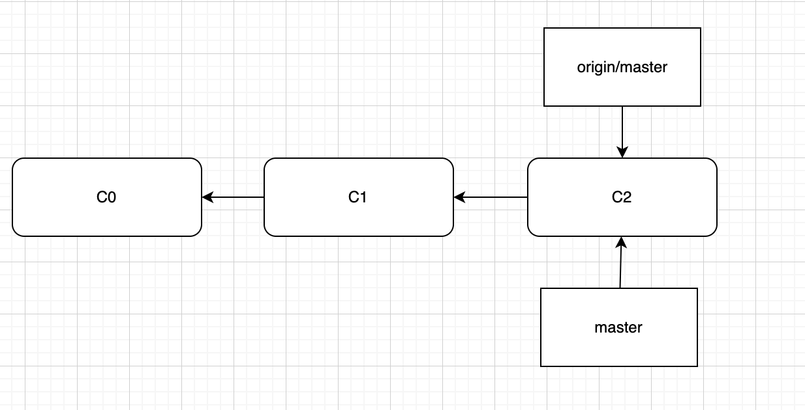

假设你在master上进行了工作，那么你的master指针就会向前移动。但是origin/mastet并不会发生移动，就算别人给远程服务器推动了数据，只要你不更新，那么你的远程指针在本地就不会发生移动。

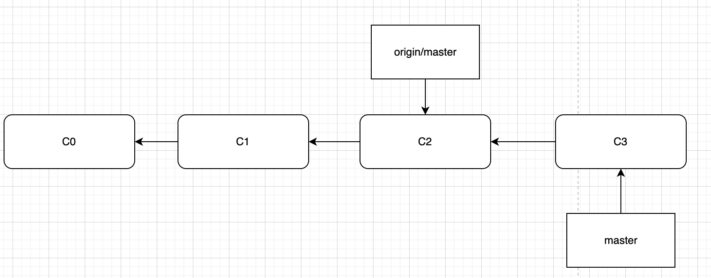

要与服务器通信，需要执行`git fetch origin`命令，这条命令会查询 'origin'对应的服务器地址，并从服务器取得所有本地尚未包含的数据，然后更新本地数据库，最后把origin/mastert指针移动到最新的上面去。

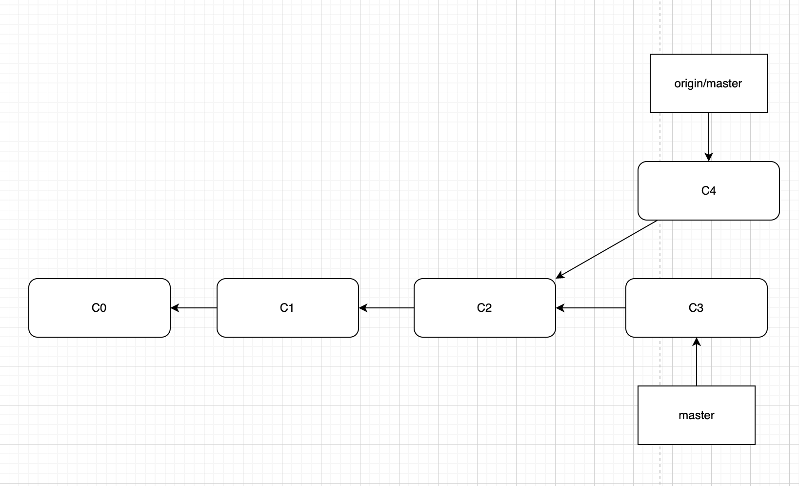

然后你可以执行merge操作，将其合并到你的master分支。


如果有多个远程服务器（一个项目但是有多个仓库）。你可以使用`git remote add`将新的远程服务器添加到正在进行的项目中。

然后执行`git fetch 新仓库名`获取服务器上本地不存在的数据。如果远程仓库的内容本地都有，Git并不会真正拉取数据，只会创建名为 远程仓库/master的远程分支。指向此仓库的最新提交。


## 推送

当你需要和别人共享某个分支上的工作成果时，就要把它推送到某一个具有写权限的远程仓库。你的本地分支并不会自动同步到远程仓库，必须显式地推送你想要共享的分支。

你可以使用`git push remote branch`命令

